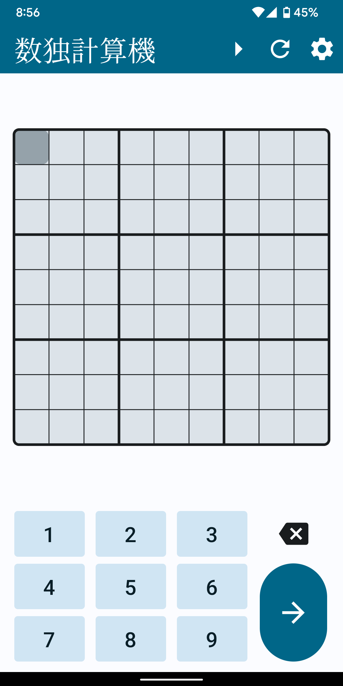
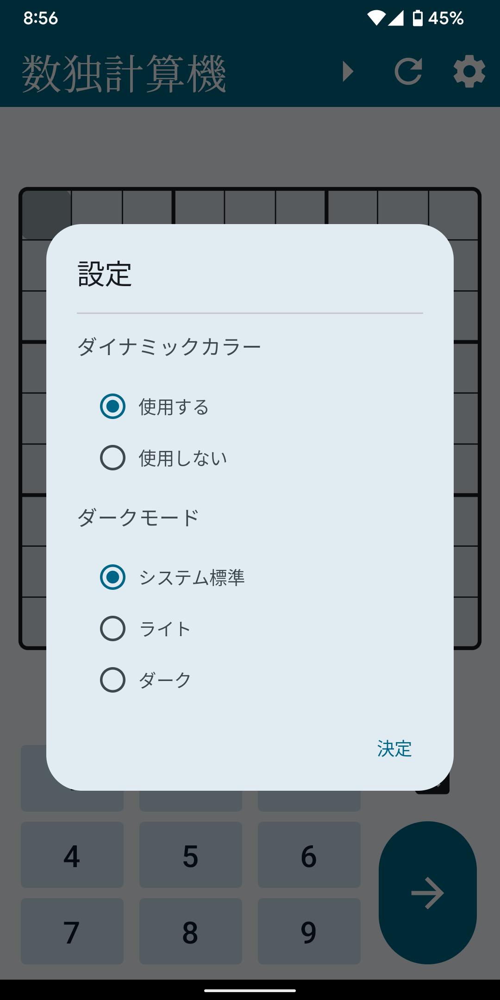
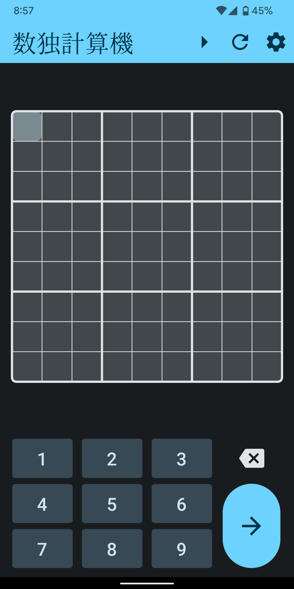
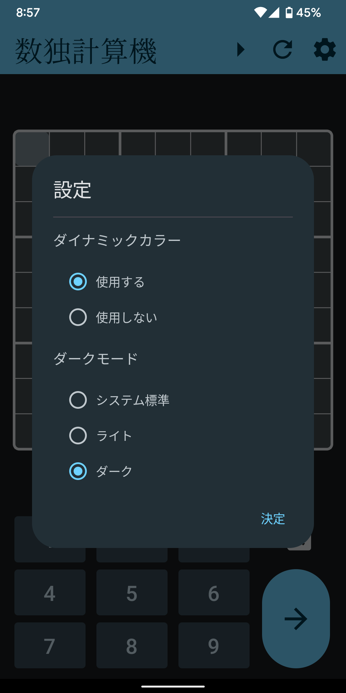
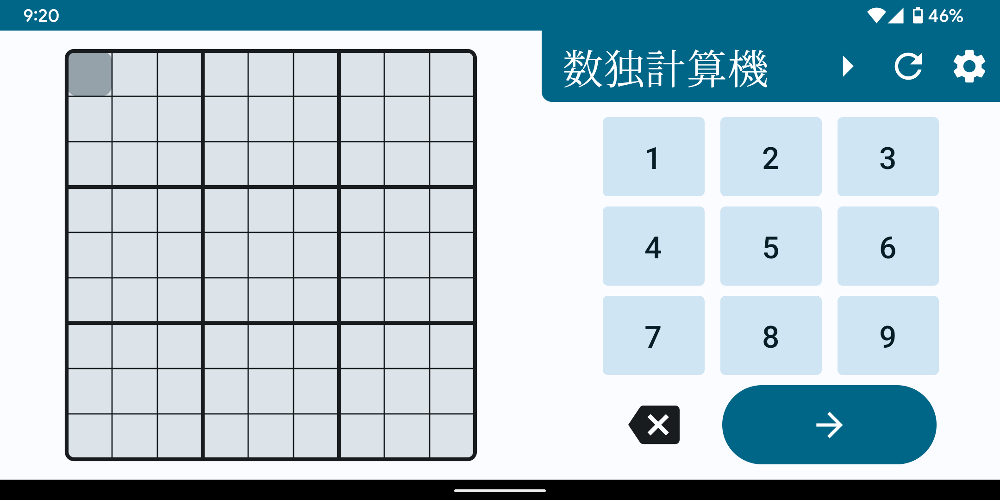
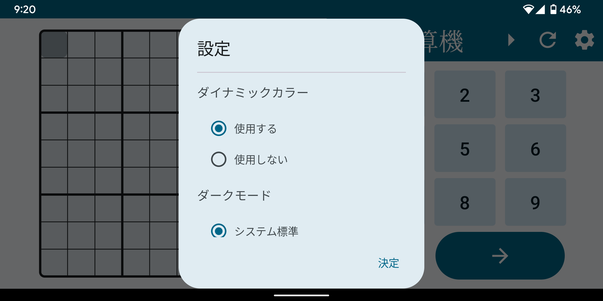
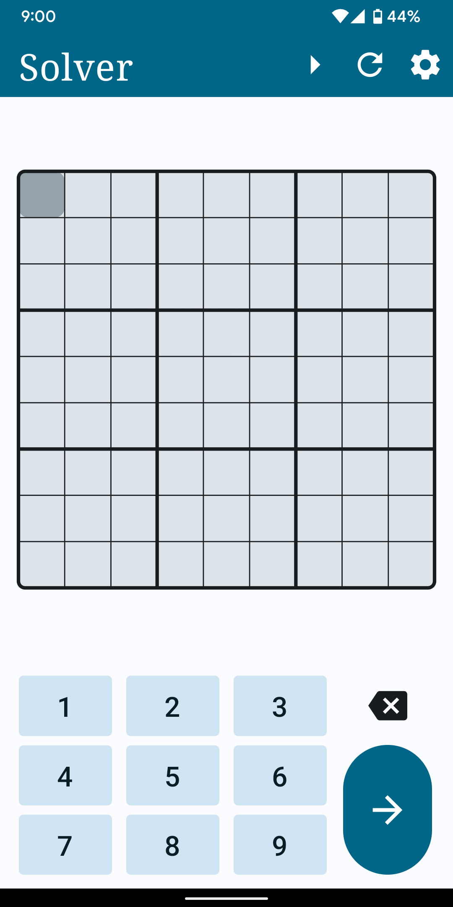
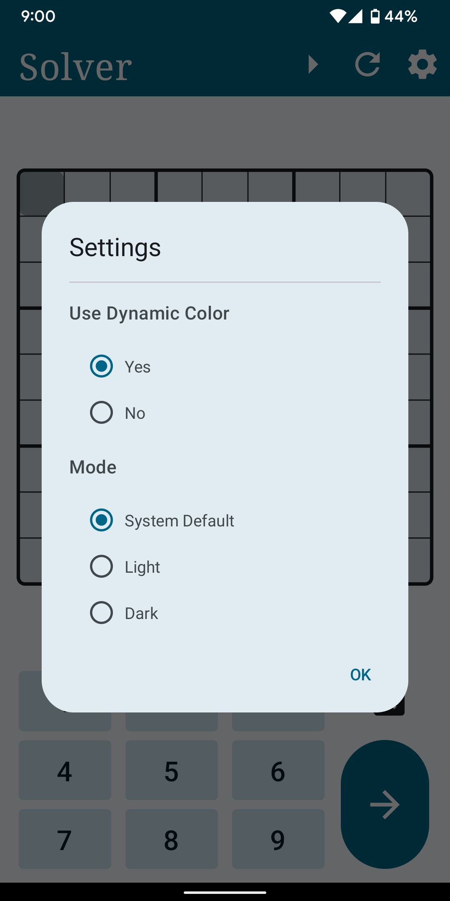

# SudokuSolver

SudokuSolver は，数独問題を Android に解答させるアプリケーションである．

## 画面構成

本アプリは，「主画面である Home Screen」と「設定用のダイアログである Settings Dialog」から構成される．

### Home Screen
 
　Home Screen は「トップバー」と「数独用フィールド」，「キーパッド」から構成される．

  - トップバー
  
    タイトルの他に 実行/停止ボタン や クリアボタン，Settings Dialog へのエントリボタンが含まれている．
  
  - 数独用フィールド
  
    入力及び結果表示に使用されるフィールドである．キーパッドからの入力に応じて，カーソル位置に数字を入力したり，数字を削除したりすることができる．また，フィールドをタップすることにより，カーソル位置の移動ができる．

### Settings Dialog

　Settings Dialog は「ダイナミックカラー」と「ダークモード」の設定項目から構成される．
 
 - ダイナミックカラー
 
   Android 12 からの機能になるため，Android 12 未満では設定項目は表示されないようにしている．

| Home Screen | Settings Dialog |
| ----------- | --------------- |
|  |  |

### ダークモード

| Home Screen | Settings Dialog |
| ----------- | --------------- |
|  |  |

### 横画面

| Home Screen | Settings Dialog |
| ----------- | --------------- |
|  |  |

### 英語表示

| Home Screen | Settings Dialog |
| ----------- | --------------- |
|  |  |

## 工夫した点

- 実行中の入力禁止

  数独計算の実行中は，クリアボタン及びキーパッドを無効にした．また，実行中は実行ボタンが停止ボタンになるようにした．

- カーソル移動

  カーソル位置には AnimateOffsetAsState を使用し，自然な移動を実現した．

- 横画面への対応

  WindowSizeClass を使用し，画面を回転に対して表示が崩れないようにした．

## 学習したこと

- Proto Datastore による，ユーザプリファレンスの保存

- WindowSizeClass を使用した「アダプティブレイアウト」

- AnimateOffsetAsState による2次元のアニメーション

## 今後の課題

- [ ] 数独計算アルゴリズムの改善

  初期実装はナイーブな全探索を行っており，非常に低速である．そのため，高速なアルゴリズムに切り替える必要がある．

- [ ] 大画面への対応

  タブレットなどの大きめのディスプレイでは，横画面表示が崩れる問題がある．

- [ ] 失敗時の対応

  数独計算を失敗した場合に，Snackbar を使用したメッセージ表示をしたい．

- [ ] 通知機能の追加

  バックグラウンド実行時には，計算完了を知らせる通知を発行したい．
